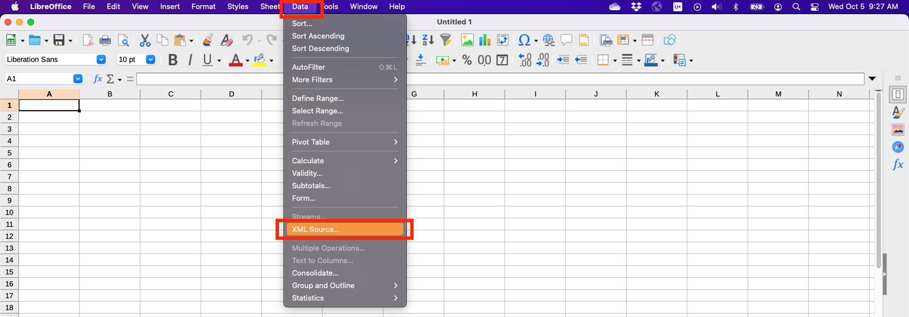
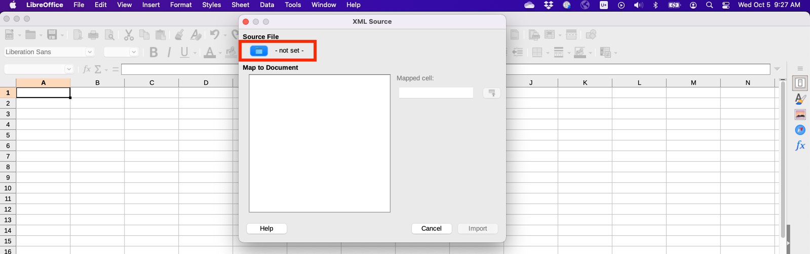
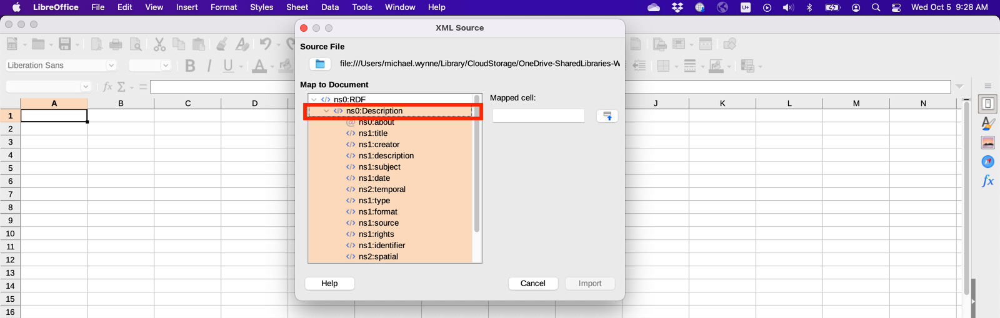
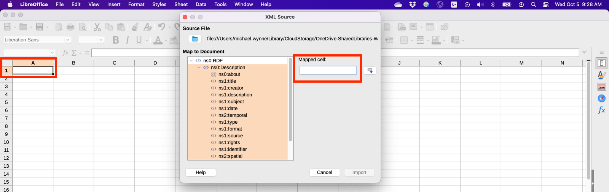
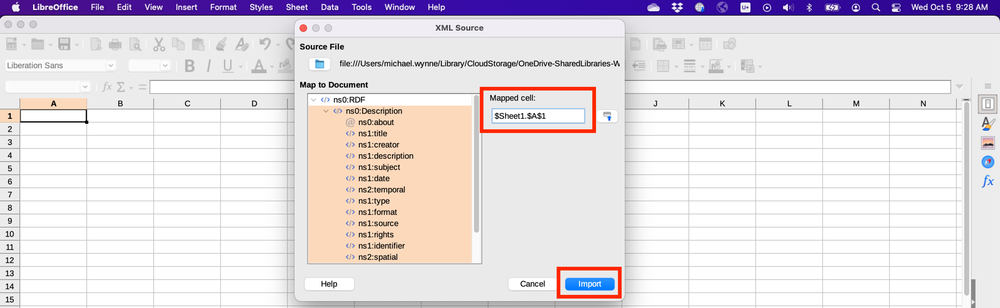
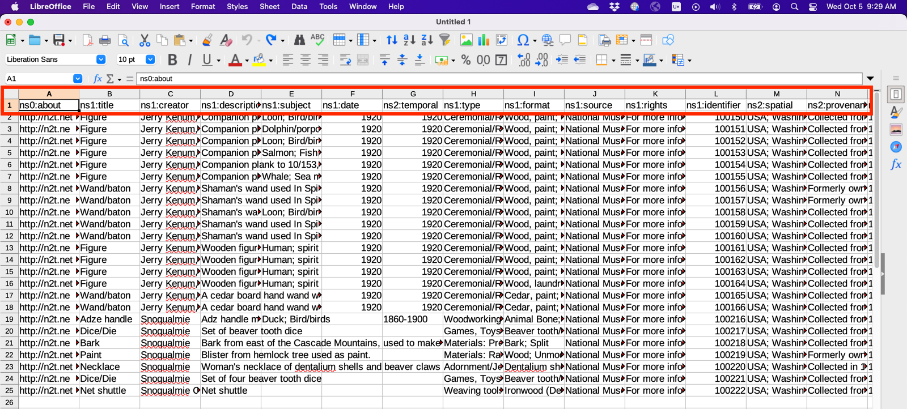
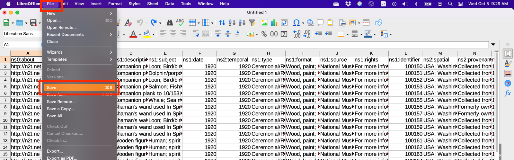
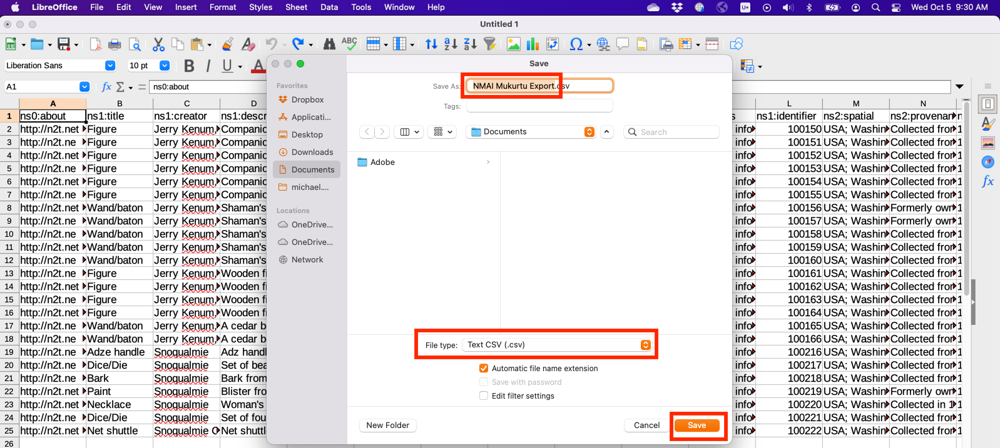
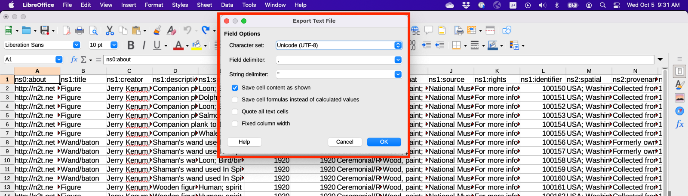

NMAI to Mukurtu Workflow
========================

NMAI delivery
_____________

The NMAI delivers metadata and media requests by email. That email typically includes:

- A link to a Dropbox folder containing:

  - The original or preservation files for all materials. Most commonly TIFF files.
  - PDF files for documents and manuscripts.
  
- An XML document with the catalog record metadata. 
- An XLSX document with additional notes note found in the catalog. This file may also include some or all of the catalog record metadata.

We recommend saving the contents of the Dropbox file and the attached documents locally as soon as possible. We are unsure how long the NMAI retains the Dropbox folders for access.

Processing media files
______________________

We recommend generating access copies of all media files for use in Mukurtu.
See https://mukurtu.org/support/mukurtu-cms-access-copy-sizes-resolutions-and-file-formats/ for more information.

Processing metadata
___________________

For batch import, Mukurtu requires that spreadsheets be UTF-8 encoded CSV files. We recommend using LibreOffice, OpenOffice, or Google Sheets for creating and editing CSV files. See https://mukurtu.org/support/file-formats-character-encoding-and-spreadsheet-tools/ for more information.

The XML files provided by the NMAI use the Dublin Core namespace and should map very easily to Mukurtu Core.

**Converting XML to CSV**

*These directions are shown using LibreOffice on MacOS. They may vary somewhat for your spreadsheet tool and operating system of choice.*

1) In a new LibreOffice Calc sheet select "Data" > "XML Source".

2) Click on the folder icon that reads "- not set -".

 
3) Click on "ns0:Description".
 

 
4) Click on the blank "Mapped cell" option. 
Then click in the first cell you want to fill in - most likely A1.
 

5) The "Mapped cell" will be automatically filled in. 
Click "Import".
 

6) The sheet should be automatically popualted, with the first row matching the XML Dublic Core namespaces.
 

 
7) Select "File" > "Save". 
 

8) Select where you want to save your file. 
Assign it a descriptive name - usually the same name as the original XML file provided by the NMAI is sufficient. Set the file type to "Text CSV (.csv)" - this will automatically assign the correct file extension in the filename. C
lick "Save".

9) Configure the following export text file settings:

- Character set: Unicode (UTF-8)

- Field delimiter: , (comma)

- String delimiter: " (quotation)

Click OK. Your file will be saved.

**Integrating XLSX data (optional)**

Information provided by the NMAI about this spreadsheet:

"The .xls spreadsheet includes “extra” information that we have in the CIS (EMu) database that does not necessarily fit into Mukurtu. This includes internal info from NMAI like past exhibits and conservation work, but also the “cultural care” information that we have. The latter in this case being info that staff have entered based on their knowledge or communications with Native communities and which we would be very interested in correcting if necessary. Note that the “Status” field is embedded in that field in parentheses, with terms such as “Confirmed,” “Unconfirmed,” and “Advisory.” The first being if it came from the community itself, the second if it was a note that we can’t identify the source, and the third being if a staff member offered it based on their own knowledge or other research. Also, if you see the word “Rights” in that field, it is simply referring to the name of the pre-existing module that we are using to hold this information in EMu. It was the best place for us to make sure the data is visible by appropriate staff.
If there is any further question about something in this spreadsheet, please let us know and we can provide any more information that we may have."																				

**Mapping NMAI fields to Mukurtu Core**
